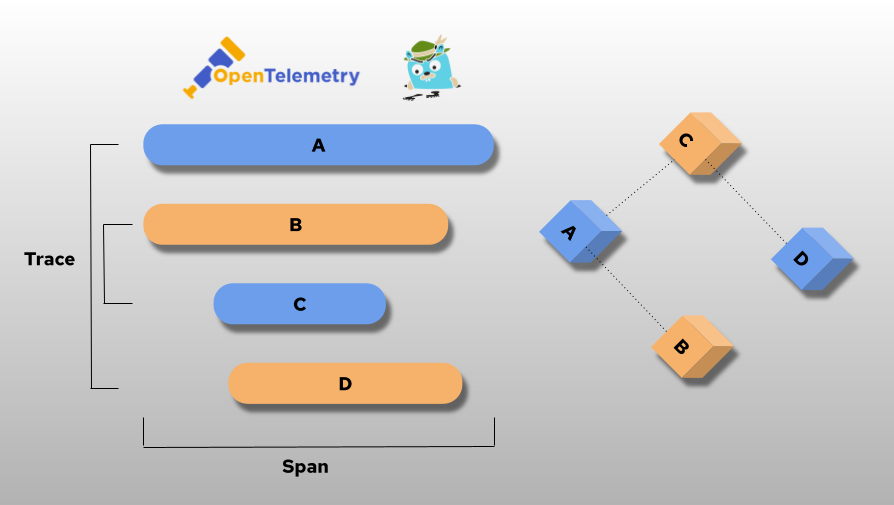
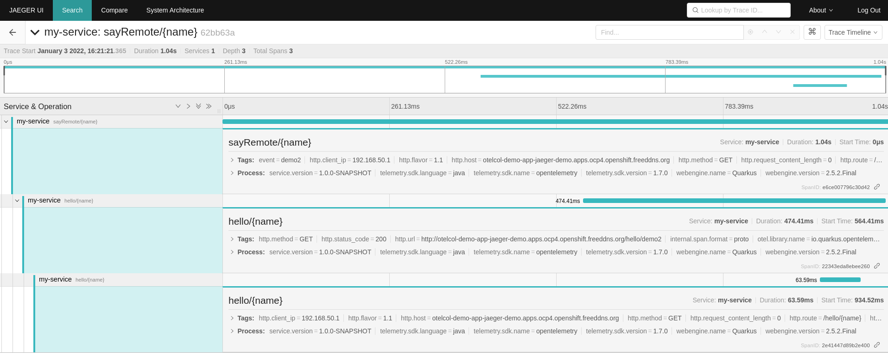

# Using OpenTelemetry and Jaeger with Your Own Services/Application



*By Robert Baumgartner, Red Hat Austria, Janurary 2022 (OpenShift 4.9)*
*By Robert Baumgartner, Red Hat Austria, Janurary 2023 (OpenShift 4.11, OpenShift distributed tracing 2.7)*

In this blog I will guide you on

- How to use OpenTelemetry with a Quarkus application.

- How to display your OpenTeleemtry information on Jaeger UI.

In this blog I will use distributed tracing to instrument my services to gather insights into my service architecture. I am using distributed tracing for monitoring, network profiling, and troubleshooting the interaction between components in modern, cloud-native, microservices-based applications.

Using distributed tracing lets you perform the following functions:

- Monitor distributed transactions
- Optimize performance and latency
- Perform root cause analysis

Red Hat OpenShift distributed tracing consists of two components:

Red Hat OpenShift distributed tracing platform - This component is based on the open source Jaeger project.
Red Hat OpenShift distributed tracing data collection - This component is based on the open source OpenTelemetry project.

This document is based on OpenShift 4.11. See [Distributed tracing release notes](https://docs.openshift.com/container-platform/4.11/distr_tracing/distributed-tracing-release-notes.html).

OpenShift distributed tracing platform Operator is based on Jaeger 1.39.

OpenShift distributed tracing data collection Operator based on OpenTelemetry 0.63.1

## OpenTelemetry and Jaeger

**OpenTelemetry** is a collection of tools, APIs, and SDKs. Use it to instrument, generate, collect, and export telemetry data (metrics, logs, and traces) to help you analyze your software’s performance and behavior.

**Jaeger** is a tool to monitor and troubleshoot transactions in complex distributed systems.

In the the following diagram I will show you how the flow will be between your application, OpenTelemetry and Jaeger.


To make the demo simpler I am using the AllInOne  image from Jaeger. This will install collector, query and Jaeger UI in a single pod, using in-memory storage by default.

More details can be found
- [OpenTelemetry Reference Architecture](https://opentelemetry.io/docs/)
- [Jaeger Components](https://www.jaegertracing.io/docs/1.39/architecture/#components)

## Enabling Distributed Tracing

A cluster administrator has to enable the Distributed Tracing Platform operator once. 

As of OpenShift 4.11, this is be done easily done by using the OperatorHub on the OpenShift console. See [Installing the Red Hat OpenShift distributed tracing platform Operator](https://docs.openshift.com/container-platform/4.11/distr_tracing/distr_tracing_install/distr-tracing-installing.html#distr-tracing-jaeger-operator-install_install-distributed-tracing).

In the current version (Jaeger 1.35+) the Red Hat OpenShift distributed tracing data collection Operator is no longer required. Jaeger has a collector port available.


In this demo we do not install the OpenShift Elasticsearch Operator, because we use only in-memory tracing - no perstistence.

Make sure you are logged in as cluster-admin:


After a short time, you can check that the operator pod is created and running and the CRDs is created:

```shell
$ oc get pod -n openshift-distributed-tracing 
NAME                               READY   STATUS    RESTARTS   AGE
jaeger-operator-6878757487-fzv4f   2/2     Running   0          3h10m
$ oc get crd jaegers.jaegertracing.io
NAME                       CREATED AT
jaegers.jaegertracing.io   2021-12-08T15:51:29Z
```

## Create a New Project

Create a new project (for example jaeger-demo) and give a normal user (such as developer) admin rights onto the project:

```shell
$ oc new-project jaeger-demo
Now using project "jaeger-demo" on server "https://api.yourserver:6443".

You can add applications to this project with the 'new-app' command. For example, try:

    oc new-app rails-postgresql-example

to build a new example application in Ruby. Or use kubectl to deploy a simple Kubernetes application:

    kubectl create deployment hello-node --image=k8s.gcr.io/serve_hostname
$ oc policy add-role-to-user admin developer -n jaeger-demo 
clusterrole.rbac.authorization.k8s.io/admin added: "developer"
```

## Login as the Normal User

```shell
$ oc login -u developer
Authentication required for https://api.yourserver:6443 (openshift)
Username: developer
Password: 
Login successful.

You have one project on this server: "jaeger-demo"

Using project "jaeger-demo".
```

## Create Jaeger

Create a simple Jaeger instance with the name my-jager
```shell
$ cat <<EOF |oc apply -f -
apiVersion: jaegertracing.io/v1
kind: Jaeger
metadata:
  name: my-jaeger
spec: {}
EOF
jaeger.jaegertracing.io/my-jaeger created
```

When the Jaeger instance is up and running you can check the service and route.

```
$ oc get svc
NAME                           TYPE        CLUSTER-IP      EXTERNAL-IP   PORT(S)                                                    AGE
my-jaeger-agent                ClusterIP   None            <none>        5775/UDP,5778/TCP,6831/UDP,6832/UDP                        3h10m
my-jaeger-collector            ClusterIP   172.30.99.244   <none>        9411/TCP,14250/TCP,14267/TCP,14268/TCP,4317/TCP,4318/TCP   3h10m
my-jaeger-collector-headless   ClusterIP   None            <none>        9411/TCP,14250/TCP,14267/TCP,14268/TCP,4317/TCP,4318/TCP   3h10m
my-jaeger-query                ClusterIP   172.30.139.99   <none>        443/TCP,16685/TCP                                          3h10m
otelcol-demo-app               ClusterIP   172.30.203.18   <none>        8080/TCP                                                   3h3m
$ oc get route my-jaeger -o jsonpath='{.spec.host}'
my-jaeger-jaeger-demo.apps.rbaumgar.demo.net
```

Open a new browser window and go to the route url and login with your OpenShift login (developer).


## Sample Application

### Deploy a Sample Application

All modern application development frameworks (like Quarkus) supports OpenTelemetry features, [Quarkus - USING OPENTELEMETRY](https://quarkus.io/guides/opentelemetry).

To simplify this document, I am using an existing example. The application is based on an example at [GitHub - rbaumgar/otelcol-demo-app: Quarkus demo app to show OpenTelemetry with Jaeger](https://github.com/rbaumgar/otelcol-demo-app). 

Deploying a sample application monitor-demo-app end expose a route:

```shell
$ cat <<EOF |oc apply -f -
apiVersion: apps/v1
kind: Deployment
metadata:
  labels:
    app: otelcol-demo-app
    app.kubernetes.io/name: otelcol-demo-app
    app.kubernetes.io/version: 1.0.0-SNAPSHOT
    app.openshift.io/runtime: quarkus
  name: otelcol-demo-app
spec:
  replicas: 1
  selector:
    matchLabels:
      app: otelcol-demo-app
  template:
    metadata:
      labels:
        app: otelcol-demo-app
        app.openshift.io/runtime: quarkus
        app.kubernetes.io/name: otelcol-demo-app
        app.kubernetes.io/version: 1.0.0-SNAPSHOT        
    spec:
      containers:
      - image: quay.io/rbaumgar/otelcol-demo-app-jvm
        imagePullPolicy: Always
        name: otelcol-demo-app
---
apiVersion: v1
kind: Service
metadata:
  labels:
    app: otelcol-demo-app
    app.kubernetes.io/name: otelcol-demo-app
    app.kubernetes.io/version: 1.0.0-SNAPSHOT
    app.openshift.io/runtime: quarkus    
  name: otelcol-demo-app
spec:
  ports:
  - port: 8080
    protocol: TCP
    targetPort: 8080
    name: web
  selector:
    app: otelcol-demo-app
  type: ClusterIP
---
apiVersion: route.openshift.io/v1
kind: Route
metadata:
  labels:
    app: otelcol-demo-app
    app.kubernetes.io/name: otelcol-demo-app
    app.kubernetes.io/version: 1.0.0-SNAPSHOT
    app.openshift.io/runtime: quarkus       
  name: otelcol-demo-app
spec:
  path: /
  to:
    kind: Service
    name: otelcol-demo-app
  port:
    targetPort: web
  tls:
    termination: edge    
EOF
deployment.apps/otelcol-demo-app created
service/otelcol-demo-app created
route.route.openshift.io/otelcol-demo-app exposed
```

You can add an environment variable with the name OTELCOL_SERVER if you need to specify a different url for the OpenTelemetry Collector. Default: http://my-jaeger-collector:4317 

### Test Sample Application

Check the router url with */hello* and see the hello message with the pod name. Do this multiple times.

```shell
$ export URL=https://$(oc get route otelcol-demo-app -o jsonpath='{.spec.host}')
$ curl $URL/hello
hello 
$ curl $URL/sayHello/demo1
hello: demo1
$ curl $URL/sayRemote/demo2
hello: demo2 from http://otelcol-demo-app-jaeger-demo.apps.rbaumgar.demo.net/
...
```

Go to Jager URL.
Reload by pressing F5.
Under Service select my-service. 
Find Traces...


*star* The service name is specified in the application.properties (quarkus.application.name) of the demo app.
*star* The url of the collector is specified in the application.properties (quarkus.opentelemetry.tracer.exporter.otlp.endpoint=http://my-jaeger-collector:4317).

Open one trace entry and expand it to get all the details.



Done!

If you want more details on how the OpenTracing is done in Quarkus go to the Github example at [GitHub - rbaumgar/otelcol-demo-app: Quarkus demo app to show OpenTelemetry with Jaeger](https://github.com/rbaumgar/otelcol-demo-app). 


## Remove this Demo

```shell
$ oc delete deployment,svc,route otelcol-demo-app
$ oc delete jaeger my-jaeger
$ oc delete project jaeger-demo
```

This document: 

**[Github: rbaumgar/otelcol-demo-app](https://github.com/rbaumgar/otelcol-demo-app/blob/master/OpenTelemetry.md)**